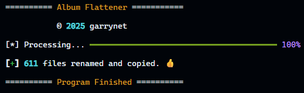

# Album Flattener



## Description

This Python script collects all photos from subfolders (treated as "albums") and copies them into a single root `output` folder.

Each photo is renamed using the following format:

`[name-of-folder] - [6-character-xxhash].[filetype]`

> A hash is added to prevent collisions. xxHash was chosen for its performance.

### Example

A photo named `DSC_0583.jpg` inside a folder called `Family Vacation '24` would be renamed and copied into the `output` folder as:

`Family Vacation '24 - 891a1d.jpg`

## Usage

1. Create and activate virtual environment:

```bash
python -m venv .venv

source .venv/bin/activate
```

2. Install the required dependencies:

```bash
pip install -r requirements.txt
```

3. Place your album/photo folders inside the ./input directory.

4. Run the script:

```bash
python flatten.py
```

5. Your photos can be found in `./output`
